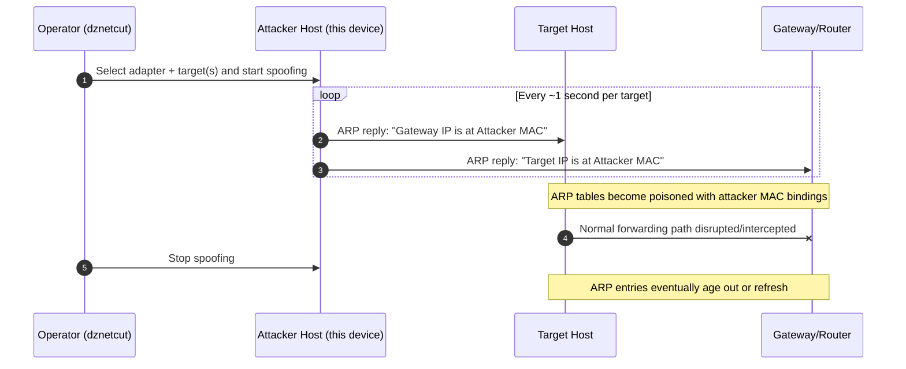

# dznetcut

`dznetcut` is a Windows desktop network tool for **discovering LAN hosts** and **performing targeted ARP interruption** tests from a single interface.

> ⚠️ **Authorized use only:** ARP spoofing can disrupt connectivity for other devices. Use this project only on networks and systems you own or are explicitly permitted to test.

---

## What this tool does

`dznetcut` combines two workflows:

1. **Host discovery** on the local IPv4 subnet.
2. **Targeted ARP poisoning** to interrupt selected hosts' connectivity through the gateway.

The scanner correlates evidence from multiple protocols (ARP, ICMP, passive traffic hints, and local-name discovery traffic) and keeps confidence-scored host records before showing candidates in the UI.

---

## Key features

- **Windows Forms GUI** for adapter selection, scanning, target selection, and live logging.
- **Interface-aware adapter selection** that prefers physical adapters with usable IPv4 context.
- **Multi-signal host discovery** with confidence scoring and host evidence aggregation.
- **Targeted spoof loop** that sends unicast ARP replies to both target and gateway.
- **ARP protection safeguards** that block spoofing against protected identities (your source host and the detected gateway).
- **Saved device labels** so known MAC addresses can be named in the UI.

## CLI

`dznetcut` now supports CLI entry routing in the same executable:

- Launch GUI (default): `dznetcut`
- Force GUI: `dznetcut --gui`
- Show CLI help: `dznetcut --help`
- List adapters: `dznetcut list-adapters`
- Scan: `dznetcut scan --adapter "Ethernet" --gateway-ip 192.168.1.1 --duration 25`
- Cut: `dznetcut cut --adapter "Ethernet" --gateway-ip 192.168.1.1 --gateway-mac AA-BB-CC-DD-EE-FF --target 192.168.1.42@11-22-33-44-55-66 --duration 30`

CLI command surface includes `scan`, `cut`, and `stop`.

GUI includes **Help → Command line parameters** to show the same CLI usage text inline.

### ARP protection flag

For CLI `cut` mode, ARP protection is enabled by default.
To disable it, use:

- `--no-arp-protection` (or `-nap`)
---

## Requirements

- **OS:** Windows (GUI app targeting .NET Framework 4.8.1)
- **Runtime/SDK:** .NET Framework 4.8.1 developer tooling (typically via Visual Studio)
- **Packet capture driver:** **Npcap** (required by SharpPcap/LibPcap on Windows)
- **Privileges:** Administrative permissions are typically required for raw capture/transmit operations

---

## Installation and build

### 1) Clone

```bash
git clone https://github.com/DeltaZulu-OU/dznetcut.git
cd dznetcut
```

### 2) Restore/build (Visual Studio)

Open `dznetcut.sln`, restore NuGet packages, and build in `Release` or `Debug`.

### 3) Build from CLI (Developer Command Prompt)

```bash
dotnet restore dznetcut.sln
dotnet build dznetcut.sln -c Release
```

---

## How cutoff works (Mermaid)



This ARP-poisoning loop continuously refreshes forged IP→MAC mappings so the target and gateway stop trusting each other's real hardware address during the active cutoff window.

---

## Usage guide

1. Launch `dznetcut` as administrator.
2. Select the network adapter connected to the target LAN.
3. Start scanning and wait for host discovery to stabilize.
4. Review host list and confidence (gateway and local host are protected).
   - If only protected hosts are selected, cutoff is rejected and no spoofing task starts.
5. Select one or more target hosts.
6. Start spoofing to interrupt selected hosts.
7. Stop spoofing to terminate active ARP poison tasks.

**Operational note:** Behavior depends on network topology, endpoint ARP behavior, and local network defenses.

---

## Safety, legality, and ethics

This repository is intended for:

- lab simulations,
- defensive validation,
- red-team exercises with authorization,
- incident response diagnostics in controlled environments.

Do **not** use it on third-party networks, shared infrastructure, or any environment without explicit written permission.

---

## Testing

Unit tests are in `dznetcut.Tests`.

```bash
dotnet test dznetcut.Tests/dznetcut.Tests.csproj
```

---

## Licensing & provenance

- `dznetcut` is a hard fork of [`globalpolicy/csarp-netcut`](https://github.com/globalpolicy/csarp-netcut) (fork point `6952d98`) with components from [`DeltaZulu-OU/dzmac`](https://github.com/DeltaZulu-OU/dzmac).
- Current project lineage starts from commit `cbaba0b`.
- License for current codebase: [GPL-3.0-only](LICENSE).
- Historical upstream notice: [MIT License](LICENSE-MIT).

---

## Maintainer

DeltaZulu OÜ  
Author: Zafer Balkan
