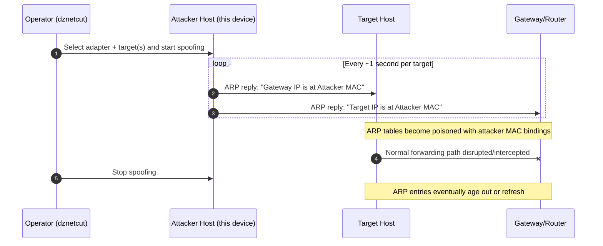

# dznetcut

`dznetcut` is a Windows network operations tool for **LAN host discovery** and **targeted ARP interruption testing** from a single interface.

> ⚠️ **Authorized use only:** ARP spoofing can disrupt connectivity. Use this project only on infrastructure you own or are explicitly authorized to test.

## Table of contents

- [Overview](#overview)
- [Feature summary](#feature-summary)
- [Command-line usage](#command-line-usage)
- [How ARP cutoff works](#how-arp-cutoff-works)
- [Requirements](#requirements)
- [Build and setup](#build-and-setup)
- [GUI workflow](#gui-workflow)
- [Testing](#testing)
- [Safety, legal use, and ethics](#safety-legal-use-and-ethics)
- [Licensing and provenance](#licensing-and-provenance)
- [Maintainer](#maintainer)

## Overview

`dznetcut` combines two workflows in one executable:

1. **Subnet host discovery** on IPv4 LANs.
2. **Selective ARP poisoning** against chosen hosts to interrupt routing through the gateway.

Host discovery is evidence-driven: ARP, ICMP, passive traffic hints, and local naming traffic are correlated into confidence-scored host entries before operators choose targets.

## Feature summary

- **Windows Forms GUI** for adapter selection, scan control, target selection, and live logs.
- **Adapter-aware interface selection** that prioritizes usable physical adapters.
- **Multi-signal host discovery** with confidence scoring and evidence aggregation.
- **Targeted spoof loop** that sends ARP replies to both gateway and target(s).
- **ARP protection guards** for protected identities (local host and detected gateway).
- **Stealth scan mode (GUI)** that adds randomized pacing delays to discovery probes to reduce bursty scan signatures.
- **Saved device labels** for recognizable MAC-to-name mapping.
- **Unified entry point**: GUI and CLI are routed through the same executable.

## Command-line usage

### Entry modes

- Launch GUI (default): `dznetcut`
- Force GUI: `dznetcut --gui`
- Help: `dznetcut --help`

### Commands

- List adapters:
  ```bash
  dznetcut list-adapters
  ```
- Scan:
  ```bash
  dznetcut scan --adapter "Ethernet" --gateway-ip 192.168.1.1 --duration 25
  ```
- Cut:
  ```bash
  dznetcut cut \
    --adapter "Ethernet" \
    --gateway-ip 192.168.1.1 \
    --gateway-mac AA-BB-CC-DD-EE-FF \
    --target 192.168.1.42@11-22-33-44-55-66 \
    --duration 30
  ```
- Stop:
  ```bash
  dznetcut stop
  ```

### ARP protection flag

For `cut` mode, ARP protection is enabled by default.
Disable only when intentionally required:

- `--no-arp-protection` (alias: `-nap`)

### GUI help parity

The GUI includes **Help → Command line parameters**, which shows the same CLI command surface inline.

## How ARP cutoff works



During an active cutoff window, forged IP→MAC mappings are continuously refreshed so target and gateway stop trusting each other’s real hardware addresses.

## Requirements

- **Operating system:** Windows
- **Framework target:** .NET Framework 4.8.1
- **Build tooling:** Visual Studio with .NET Framework developer tools
- **Capture/transmit driver:** Npcap (required by SharpPcap/LibPcap on Windows)
- **Privileges:** Administrator rights are typically required for raw packet capture/transmission

## Build and setup

### 1) Clone

```bash
git clone https://github.com/DeltaZulu-OU/dznetcut.git
cd dznetcut
```

### 2) Build with Visual Studio

Open `dznetcut.sln`, restore NuGet packages, then build (`Debug` or `Release`).

### 3) Build from command line

Use a Developer Command Prompt (or equivalent configured environment):

```bash
dotnet restore dznetcut.sln
dotnet build dznetcut.sln -c Release
```

## GUI workflow

1. Run `dznetcut` as administrator.
2. Select the adapter connected to the target LAN.
3. *(Optional)* Enable **Edit → Stealth mode** to slow discovery pacing with additional randomized jitter.
4. Start scanning and wait for host confidence to stabilize.
5. Review hosts (local host and gateway are protected identities).
6. Select one or more non-protected targets.
7. Start spoofing.
8. Stop spoofing to terminate active ARP poison tasks.

If only protected hosts are selected, cutoff is rejected and no spoofing task starts.

## Testing

Unit tests live in `dznetcut.Tests`.

```bash
dotnet test dznetcut.Tests/dznetcut.Tests.csproj
```

## Safety, legal use, and ethics

This project is intended for:

- lab simulations,
- defensive validation,
- authorized red-team exercises,
- incident-response diagnostics in controlled environments.

Do **not** use this tool on third-party networks or shared infrastructure without explicit written permission.

## Licensing and provenance

- `dznetcut` is a hard fork of [`globalpolicy/csarp-netcut`](https://github.com/globalpolicy/csarp-netcut) (fork point `6952d98`) with components from [`DeltaZulu-OU/dzmac`](https://github.com/DeltaZulu-OU/dzmac).
- Current project lineage starts from commit `cbaba0b`.
- Current codebase license: [GPL-3.0-only](LICENSE).
- Historical upstream notice: [MIT License](LICENSE.MIT).

## Maintainer

DeltaZulu OÜ  
Author: Zafer Balkan
