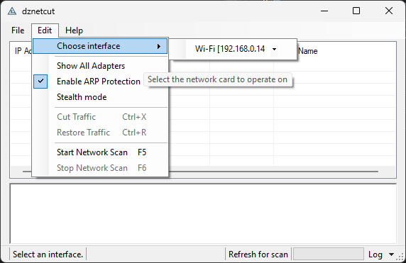

# dznetcut

`dznetcut` is a Windows LAN operations tool for **host discovery** and **authorized ARP disruption testing** with both a GUI and a CLI.

> ⚠️ **Authorized use only:** ARP spoofing can interrupt network connectivity. Use this tool only on systems and networks you own or are explicitly authorized to test.




## What’s in this version

This codebase now ships as a complete, usable application with:

- A working **Windows Forms GUI** for adapter selection, scanning, target selection, and cut control.
- A working **CLI** with command routing for adapter listing, host scans, and cut sessions.
- **Adapter inventory and selection logic** that favors usable/physical interfaces.
- **Evidence-based host discovery** using ARP, ICMP, and passive signals with confidence scoring.
- **ARP protection controls** that guard protected identities by default.
- **Unit tests** for core parsing and behavior.


## Features

- **Dual interface**: run as desktop GUI by default, or use the CLI from the same executable.
- **Discovery workflow**: enumerate hosts on the local LAN through the chosen adapter.
- **Targeted cut workflow**: repeatedly send forged ARP replies involving selected target(s) and the configured gateway during a bounded session.
- **Duration-bound execution**: scan and cut commands support a `--duration` window.
- **JSON adapter output**: `list-adapters` supports `--json`.
- **Safety defaults**: ARP protection is enabled unless explicitly disabled.


## Requirements

- **OS**: Windows
- **Runtime target**: .NET Framework 4.8.1
- **Packet driver**: Npcap, required for SharpPcap/LibPcap capture and transmit
- **Permissions**: Administrator privileges are typically required for packet-level operations
- **Build tooling**: Visual Studio recommended, or `dotnet` with .NET Framework tooling available


## Build

From repository root:

```bash
dotnet restore src/dznetcut.sln
dotnet build src/dznetcut.sln -c Release
```


## Run modes

Default GUI launch:

```bash
dznetcut
```

Force GUI launch:

```bash
dznetcut --gui
```

CLI help:

```bash
dznetcut --help
# or
dznetcut help
```


## CLI reference

### Commands

- `list-adapters` — list available capture adapters.
- `scan` — discover LAN hosts.
- `cut` — start a bounded ARP disruption session against selected target(s).
- `stop` — reserved for future background sessions; currently informational.

### Global options

- `--help`, `-h` — show help.
- `--gui` — force GUI mode.
- `--json` — JSON output where supported.
- `--verbose`, `-v` — verbose logging.

### cut-specific option

- `--no-arp-protection`, `-nap` — disable ARP protection. ARP protection is enabled by default.


## How the cut workflow works

The cut stage is the offensive part of dznetcut and must only be used in authorized environments.

In the current implementation, dznetcut performs bidirectional ARP poisoning during a bounded cut session. The operator provides the gateway IP address, gateway MAC address, and one or more selected targets. dznetcut then sends forged ARP replies involving both sides of the local conversation: the target is told that the gateway IP address belongs to the operator machine’s MAC address, and the gateway is told that the target IP address belongs to the operator machine’s MAC address.

This creates an ARP-level disruption path. dznetcut is not a forwarding relay, transparent proxy, or MITM framework. It does not attempt to forward, inspect, modify, or preserve the target’s traffic. Because traffic is redirected toward the operator machine without forwarding, the practical effect is connectivity disruption rather than a man-in-the-middle forwarding session.

If target-only disruption is desired in a future version, the implementation should change so dznetcut only poisons the selected target by impersonating the gateway from the target’s point of view. In that model, dznetcut would not poison the gateway, and `gateway-mac` would only be needed for validation, protection, or display logic.


## Examples

List adapters:

```bash
dznetcut list-adapters
```

List adapters as JSON:

```bash
dznetcut list-adapters --json
```

Scan:

```bash
dznetcut scan \
  --adapter "Ethernet" \
  --gateway-ip 192.168.1.1 \
  --duration 25
```

Cut one target:

```bash
dznetcut cut \
  --adapter "Ethernet" \
  --gateway-ip 192.168.1.1 \
  --gateway-mac AA-BB-CC-DD-EE-FF \
  --target 192.168.1.42@11-22-33-44-55-66 \
  --duration 30
```

Disable ARP protection intentionally:

```bash
dznetcut cut \
  --adapter "Ethernet" \
  --gateway-ip 192.168.1.1 \
  --gateway-mac AA-BB-CC-DD-EE-FF \
  --target 192.168.1.42@11-22-33-44-55-66 \
  --duration 30 \
  --no-arp-protection
```


## GUI quick workflow

1. Run as Administrator.
2. Choose the active LAN adapter.
3. Start scan and wait for the host list to stabilize.
4. Confirm gateway and local protected entries.
5. Select non-protected target(s).
6. Start cut.
7. Stop cut to end the active poisoning loop.


## Testing

Run unit tests:

```bash
dotnet test src/dznetcut.Tests/dznetcut.Tests.csproj
```


## Safety, legality, and ethics

Use only in:

- internal labs,
- authorized security tests,
- defensive validation,
- incident-response diagnostics on owned infrastructure.

Never run this tool against third-party or shared networks without explicit written permission.

ARP disruption can interrupt active user sessions, break application connectivity, and affect other devices on the same broadcast domain if misused. Validate the adapter, gateway, and target list before starting a cut session.


## License

- Current project code: **GPL-3.0-only** (`LICENSE`)
- Historical upstream notice: **MIT** (`LICENSE.MIT`)
